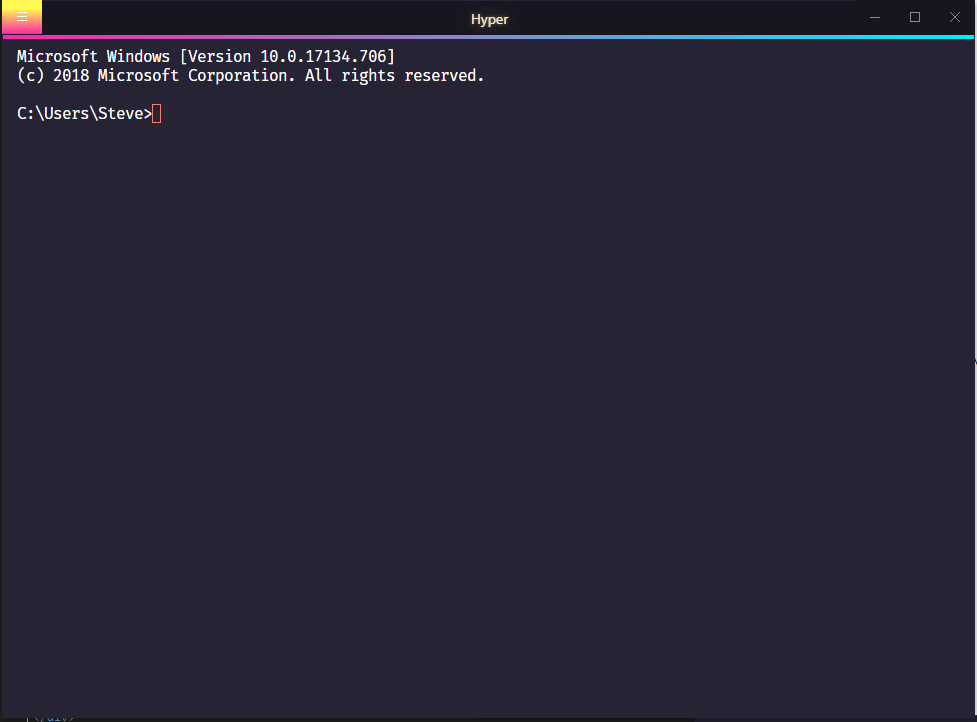
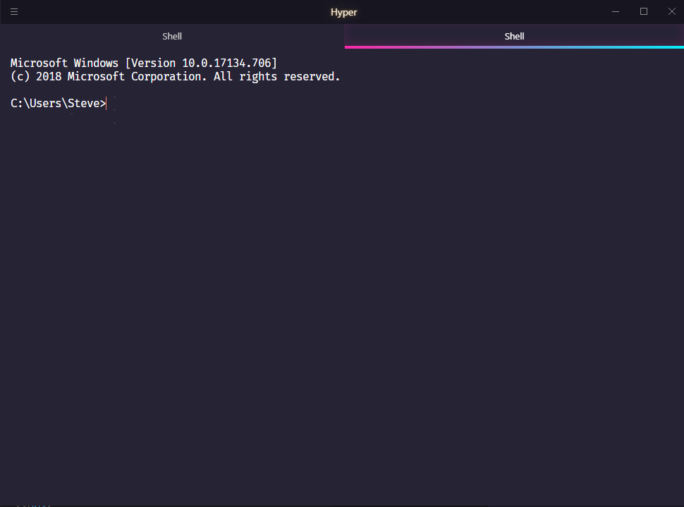

# BER theme for Hyper
Theme based off of the amazing [VSCode](https://code.visualstudio.com/) [synthwave84](https://github.com/robb0wen/synthwave-vscode) theme from [Robb Owen](https://github.com/robb0wen)

(Burst gradient is only on hover)

### Notes
* Looks best if you install [FiraMono](https://fonts.google.com/specimen/Fira+Mono) font locally 

[Optional Soundtrack](https://www.youtube.com/watch?v=uR131fc2pZY)